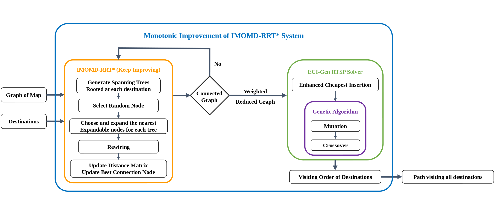
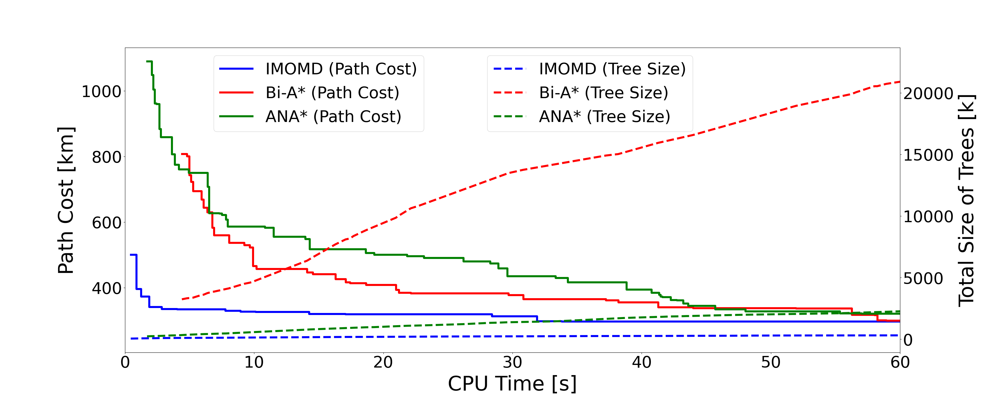
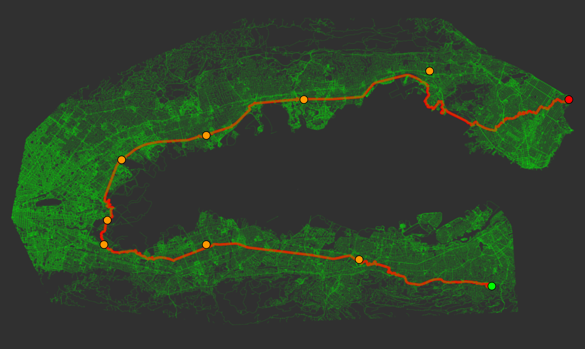
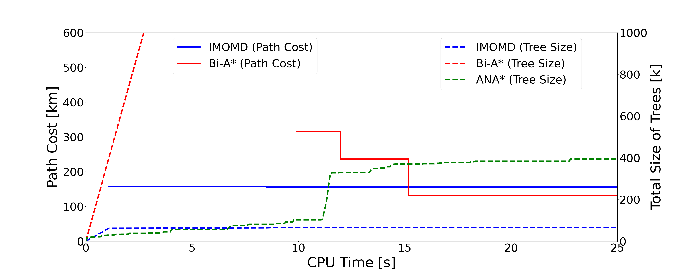

# IMOMD-RRT\* System for Robot Path Planning

## Overview
This is a package for the system of multi-objective and multi-destination path
planning, described in paper: **Informable Multi-Objective and Multi-Directional
RRT\* System for Robot Path
Planning**([PDF](https://github.com/UMich-BipedLab/IMOMD-RRTStar/tree/lib_isrr_release/052122_ISRR_imomd_rrt.pdf))([arXiv](http://arxiv.org/abs/2205.14853)).
This work is submitted to International Symposium of Robotic Research (ISRR).

The experimental results confirm that by using the IMOMD-RRT\* algorithm and the solver of relaxed traveling salesman problem (R-TSP). We outperform baseline (Bi-A\* and ANA\*) in terms of speed and memory usage.

**[Note]** This is a standalone c++ library to users to plugin to their system
without any dependency. Additionally, we also provide a ROS wrapper for the library.
Please checkout to `ros_wrapper_isrr_release` branch for more details.

* **Author** : Jiunn-Kai Huang, Yingwen Tan, Dongmyeong Lee, Vishunu R.Desaraju, and Jessy W. Grizzle
* **Maintainer** : [Bruce JK Huang](https://www.brucerobot.com/) and Dongmyeong Lee
* **Affiliation**: [The Biped Lab](https://www.biped.solutions/), the University of Michigan

This package has been tested under **ROS Melodic** and **Ubuntu 20.04**.

Table of Contents
=================

* [IMOMD-RRT* System for Robot Path Planning](#imomd-rrt-system-for-robot-path-planning)
   * [Overview](#overview)
* [Table of Contents](#table-of-contents)
   * [Abstract](#abstract)
   * [IMOMD-RRT* System](#imomd-rrt-system)
   * [Performance](#performance)
   * [Experimental Results](#experimental-results)
      * [Large Complex Map](#large-complex-map)
         * [Qualitative and Quantitative Results](#qualitative-and-quantitative-results)
      * [Bug Trap](#bug-trap)
         * [Qualitative and Quantitative Results](#qualitative-and-quantitative-results-1)
   * [Required System / Library / Packages](#required-system--library--packages)
   * [Regenerate Paper Results](#regenerate-paper-results)
   * [How to use your Own Customized Map](#how-to-use-your-own-customized-map)
   * [Citation](#citation)


## Abstract
Multi-objective or multi-destination path planning is crucial for mobile
robotics applications such as mobility as a service, robotics inspection, and
electric vehicle charging for long trips. This work proposes an anytime
iterative system to concurrently solve the multi-objective path planning problem
and determine the visiting order of destinations. The system is comprised of an
anytime informable multi-objective and multi-directional RRT∗ algorithm to form
a simple connected graph, and a proposed solver that consists of an enhanced
cheapest insertion algorithm and a genetic algorithm to solve the relaxed
traveling salesman problem in polynomial time.  Moreover, a list of waypoints is
often provided for robotics inspection and vehicle routing so that the robot can
preferentially visit certain equipment or areas of interest. We show that the
proposed system can inherently incorporate such knowledge, and can navigate
through challenging topology. The proposed anytime system is evaluated on large
and complex graphs built for real-world driving applications

## IMOMD-RRT\* System

IMOMD-RRT\* system consists of an anytime informable multi-objective and
multi-directional algorithm to construct a connected weighted-undirected graph,
and a polynomial-time solver to solve the relaxed TSP. The solver consists of an
enhanced version of the cheapest insertion algorithm and a genetic algorithm,
called ECI-Gen solver. The full system (the blue box) will continue to run to
further improve the solution over time.



## Performance
Quantitative results of the proposed IMOMD-RRT\* system on two large maps (both graphs contain more than one million nodes and edges) built for real robotics and vehicle applications. The proposed system outperforms bi-A\* and ANA\*.

<div class="tg-wrap"><table class="tg">
<thead>
  <tr>
    <th class="tg-c3ow"></th>
    <th class="tg-c3ow"></th>
    <th class="tg-c3ow">Initial Solution Time<br><br>[seconds]</th>
    <th class="tg-c3ow">Initial Path Cost<br><br>[kilometers]</th>
    <th class="tg-c3ow">Final Memory Usage<br><br>[# explored nodes]</th>
  </tr>
</thead>
<tbody>
  <tr>
    <td class="tg-9wq8" rowspan="3">Seattle<br></td>
    <td class="tg-c3ow">IMOMD-RRT∗</td>
    <td class="tg-6ic8"><strong>0.44</strong></td>
    <td class="tg-6ic8"><strong>501,342</strong></td>
    <td class="tg-6ic8"><strong>49,768</strong></td>
  </tr>
  <tr>
    <td class="tg-c3ow">Bi-A∗</td>
    <td class="tg-dvpl">4.40</td>
    <td class="tg-dvpl">808,416</td>
    <td class="tg-dvpl">3,240,515</td>
  </tr>
  <tr>
    <td class="tg-c3ow">ANA∗</td>
    <td class="tg-dvpl">1.70</td>
    <td class="tg-dvpl">1,089,873</td>
    <td class="tg-dvpl">234,457</td>
  </tr>
  <tr>
    <td class="tg-9wq8" rowspan="3">San Francisco<br></td>
    <td class="tg-c3ow">IMOMD-RRT∗</td>
    <td class="tg-6ic8"><strong>1.10</strong></td>
    <td class="tg-6ic8"><strong>156,807</strong></td>
    <td class="tg-6ic8"><strong>61,785</strong></td>
  </tr>
  <tr>
    <td class="tg-c3ow">Bi-A∗</td>
    <td class="tg-dvpl">9.93</td>
    <td class="tg-dvpl">315,061</td>
    <td class="tg-dvpl">3,640,863</td>
  </tr>
  <tr>
    <td class="tg-c3ow">ANA∗</td>
    <td class="tg-dvpl">Failed</td>
    <td class="tg-dvpl">Failed</td>
    <td class="tg-dvpl">Failed</td>
  </tr>
</tbody>
</table></div>

## Experimental Results
This section demonstrates the extensive evaluation of the IMOMD-RRT\* system applied
to two complex vehicle routing scenarios:
1. A large and complex map of Seattle, USA. 
2. A bug trap in Sanfrancisco, USA.

These maps are downloaded from
[**OpenStreetMap**](https://www.openstreetmap.org)(OSM), which is a public map
service built for real applications. 

### Large Complex Map
To show the performance and ability of multi-objective and determining the
visiting order, we randomly set **25** destinations in the Seattle map, which
contains 1,054,372 nodes and 1,173,514 edges. There are more than 23! possible
combinations of visiting orders and therefore it is intractable to solve the
visiting order by brute force. 

#### Qualitative and Quantitative Results
IMOMD-RRT\* finds the first path faster than both Bi-A\* and ANA\* with a lower
cost and then also spends less time between solution improvements. Additionally,
the memory usage of IMOMD-RRT\* is less than ANA\* and much less than Bi-A\* and
4.7 times less memory usage than ANA\*




### Bug Trap
Prior knowledge through pesudo destinations can also be leveraged to traverse
challenging topology, such as bug-traps. We provide **8** pseudo destinations to
help escape the bug trap in San Francisco, where the source and target are
separated by a body of water. The map contains 1,277,702 nodes and 1,437,713
edges.

#### Qualitative and Quantitative Results
IMOMD-RRT\* escapes from the trap nine times faster than Bi-A\*, whereas ANA\*
failed to provide a path within the given time frame. The proposed system also
consumes 58.9 times less memory than Bi-A\*




## Required System / Library / Packages 
This is a standalone library for the proposed system. There is no required
package to run the package. To plot the qualitative results, the following
requirements are required:

* Python3
    * pandas
    * matplotlib

## Regenerate Paper Results
**[Note]** To generate the result on paper, please download the
[OSM](https://drive.google.com/drive/folders/1sA5MH-K6EoiYh0PNqJMcITsmXCxjyfdJ?usp=sharing)
files into
[osm_data](https://github.com/UMich-BipedLab/IMOMD-RRTStar/tree/lib_isrr_release/osm_data) folder.

**[How To Use Config File]** In `config/algorithm_config.yaml`, you can change
parameters for the system.

1. Change the `map/name` in `config/algorithm_config.yaml` file to the name of
   file of the map you want to find a path.

2. Change the `destintaions/source_id`, `destinations/objective_ids`,
   `destintaions/target_id` to change the destinations for path planning. (idx
   of nodes should not exceed the number of nodes of map.)

3. Check comments to change other parameters. 

**[Check only qualitative results]**
* To generate the result of Fig. 9
    * IMOMD-RRT\* : run `main`
    * Bi-A\* : change `general/system` value to `1` and run `main`
    * ANA\* : change `general/system` value to `2` and run `main`

- To generate the result of Fig.10
    * change `map/name` value to `sanfrancisco_bugtrap.osm` that you downloaded
      into
      [osm_data](https://github.com/brucejk/MO-RRTStar/tree/release/osm_data)
      folder.
    * change `general/pseudo` value to `1`
    * change `rrt_params/goal_bias` value to 0.3
    * change `destinations/source_id`, `destinations/objective_ids`, and
      `destinations/target_id` value by comment out the values under Seattle and
      uncomment the values under sanfrancisco_bugtrap.

    * IMOMD-RRT\* : change `general/system` value to `0` and run `main`
    * Bi-A\* : change `general/system` value to `1` and run `main`
    * ANA\* : change `general/system` value to `2` and run `main`

**[Plot quantitative results]**
* Move CSV files that you want to compare from `experiments` folder to
  `experiments/large/seattle` or `experiments/bugtrap/sanfrancisco` folder.
* Change
  [folder](https://github.com/UMich-BipedLab/IMOMD-RRTStar/tree/lib_isrr_release/experiments/plot_result.py#L7)
  value in `experiments/plot_results.py` into the folder name you placed CSV
  files.
* Change
  [files](https://github.com/UMich-BipedLab/IMOMD-RRTStar/tree/lib_isrr_release/experiments/plot_result.py#L9)
  value in `experiments/plot_results.py` into the file name you placed in the
  above folder. ex) `imomd.csv` -> `imomd`
* run `experiments/plot_results.py`
    
**[Visualization through Rviz]**
* Please checkout to `ros_wrapper_isrr_release` branch and follow the instruction there.

## How to use your Own Customized Map
If you want to execute IMOMD-RRT\* on your own customized map, it requires two
data structure.

* **nodes** : `std::shared_ptr<std::vector<location_t>> raw_map`
    * A list of `location_t` that includes id, latitude, longitude
* **edges** : `std::shared_ptr<std::vector<std::unordered_map<size_t, double>>> graph`
    * An adjacency list with `{node_id, haversine distance}`

Please take a look
[fake_map.h](https://github.com/UMich-BipedLab/IMOMD-RRTStar/tree/lib_isrr_release/include/fake_map/fake_map.h)
for example. 

## Citation
The detail is described in: **Informable Multi-Objective and Multi-Directional
RRT\* System for Robot Path Planning**, Jiunn-Kai (Bruce) Huang, Yingwen Tan,
Dongmyeong Lee, Vishunu R. Desaraju, and Jessy W. Grizzle
([PDF](https://github.com/UMich-BipedLab/IMOMD-RRTStar/tree/lib_isrr_release/052122_ISRR_imomd_rrt.pdf))([arXiv](http://arxiv.org/abs/2205.14853)).
```
@article{huang2022imomd,
      title={Informable Multi-Objective and Multi-Directional RRT* System for Robot Path Planning},
      author={Jiunn-Kai Huang and Yingwen Tan and Dongmyeong Lee and Vishnu R. Desaraju and Jessy W. Grizzle},
      year={2022},
      eprint={2205.14853},
      archivePrefix={arXiv},
      primaryClass={cs.RO}
}
```
